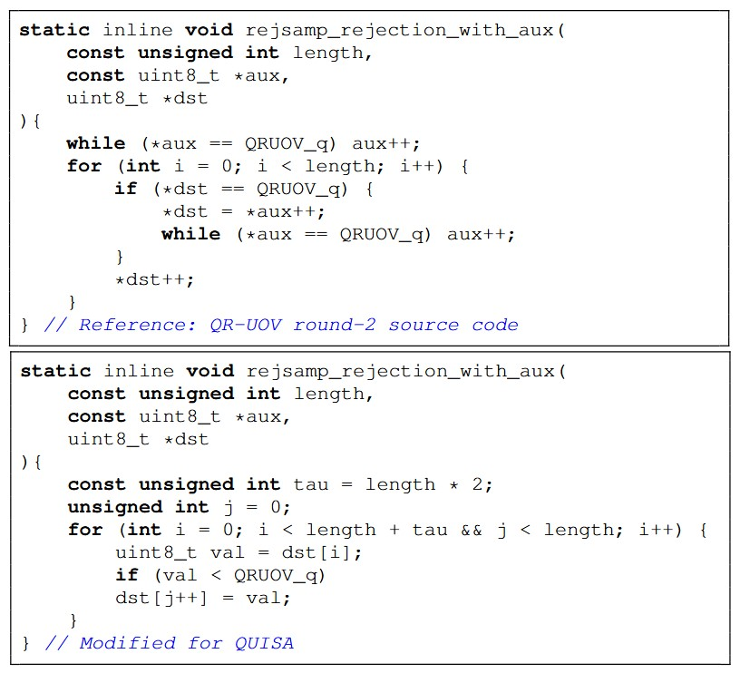

# QUISA: QR-UOV-based Instruction-Set Coprocessor Architecture


## Disclaimer
This project is intended for research purposes only. 
The authors assume no responsibility for any bugs, errors, or failures arising from the use of this code outside its intended scope. 

---

## How to Configure the QUISA for different security levels 
To run the behavioral simulations, simply set the SECAP signal in the top module (qruov_top.v) according to the desired security level.
1. SECAP = 1 (for SL-I)
2. SECAP = 5 (for SL-III)
3. SECAP = 9 (for SL-V)

-- No additional changes are required. 


## Overview

**QUISA** is a flexible and unified instruction-set coprocessor architecture for the QR-UOV post-quantum digital signature scheme. It supports key generation, signing, and verification across all NIST-defined security levels (SL-I, SL-III, SL-V) within a fixed hardware footprint, scaling only in clock cycles.

This repository contains the complete RTL implementation accompanying the paper:

> **"QUISA: A Compact, Flexible and Unified Instruction-Set Coprocessor for QR-UOV Signature"**  
> Will be added later.  
> Submitted to IEEE Transactions on Computers (TC), 2026.  
> DOI: *(to be added upon publication)*

---

## Repository Structure 

```
QUISA/
├── rtl/                                         # RTL source files
│   ├── qruov_top.v                              # Top module of QUISA
│   │
│   ├── Parallel Pseudorandom Sampling and
│   │   Packing Unit (PPSPU)
│   │   ├── shake_wrapper.v                      # SHAKE-128/256 wrapper top module
│   │   ├── keccak.vhd                           # KECCAK top module
│   │   ├── keccak_round.vhd                     # KECCAK round module
│   │   ├── keccak_round_constants_gen.vhd       # KECCAK round-constant generator
│   │   ├── keccak_buffer.vhd                    # KECCAK buffer
│   │   ├── rejsamp.v                            # Rejection-sampling top module
│   │   ├── rejsamp_and_q.v                      # Generates elements over F_q and F_q^m
│   │   ├── eight_bytes_reordering.v             # Byte Selector Unit
│   │   ├── op_format_block_rejsamp.v            # Output Format Block for 24-bit writes
│   │   └── byte_stream_unit.v                   # Byte-stream support for Hash operations
│   │
│   ├── Arithmetic Unit (AU)
│   │   ├── arithmetic_unit.v                    # AU top and address-generation logic
│   │   ├── mac_tile.v                           # Multiply-accumulate tile
│   │   ├── mod_add.v                            # Three-lane modular adder
│   │   └── mod_sub.v                            # Three-lane modular subtractor
│   │
│   ├── Linear System Solver (LSS)
│   │   ├── s_solution.v                         # Sample Solution unit
│   │   ├── lu_decompose.v                       # LU decomposition block
│   │   └── copy_words.v                         # Word-copy block
│   │
│   ├── compare.v                                # Signature-verification compare unit
│   ├── memory.v                                 # MEM-3 implementation
│   └── qruov_parameters.v                       # QR-UOV parameter configuration
│
├── header_files/                                # Verilog header files
│   └── signal_sizes.vh                          # Signal-width definitions
│
├── coefficient_files/                           # Memory coefficient files
│   ├── INT_MEM_SL_I.coe                         # SL-I Pi,3 verification coefficients
│   ├── INT_MEM_SL_III.coe                       # SL-III Pi,3 verification coefficients
│   └── INT_MEM_SL_V.coe                         # SL-V Pi,3 verification coefficients
│
├── tb/                                          # Testbench files
│   ├── TB_KG_SL1.v                              # SL-I key generation
│   ├── TB_KG_SL3.v                              # SL-III key generation
│   ├── TB_KG_SL5.v                              # SL-V key generation
│   ├── TB_SIGN_SL1.v                            # SL-I signing
│   ├── TB_SIGN_SL3.v                            # SL-III signing
│   ├── TB_SIGN_SL5.v                            # SL-V signing
│   ├── TB_VERIFY_SL1.v                          # SL-I verification
│   ├── TB_VERIFY_SL3.v                          # SL-III verification
│   └── TB_VERIFY_SL5.v                          # SL-V verification
│
├── constraints/                                 # Xilinx XDC constraint files
│   └── constraints.xdc                          # Artix-7 timing and pin constraints
│
├── docs/                                        # Documentation figures
│   └── rejection_sampling.jpg                   # Rejection-sampling modification
│
└── README.md                                    # Repository documentation
```

---

## Target Platform

| Property        | Details                        |
|-----------------|--------------------------------|
| FPGA            | Artix-7 (XC7A200T) 			       |
| Tool            | Vivado (2023.2)                |
| Evaluation      | Post-place-and-route (Post-PAR)|
| Clock Frequency | 80 MHz                         |

---

## QR-UOV Parameter Sets

| Security Level | q   | v   | m   | ℓ |
|----------------|-----|-----|-----|---|
| SL-I           | 127 | 156 | 54  | 3 |
| SL-III         | 127 | 228 | 78  | 3 |
| SL-V           | 127 | 306 | 105 | 3 |

---

## FPGA Resource Utilization (Artix-7, Post-PAR) (supporting SL-I to SL-V security levels)

| Resource  	| Utilization |
|-------------|-------------|
| Slices    	| 11,144      |
| LUTs      	| 35,248      |
| FFs       	| 18,375      |
| DSPs      	| 0 	        |
| BRAM Tiles  | 221 	      |

---

## Performance (in terms of clock cycles) Summary (at 80 MHz)

| Operation      | SL-I 		 | SL-III 		| SL-V 		 |
|----------------|---------------|--------------|------------|
| Key Generation | 5,330,536 	 | 535,697      | 399,777    |
| Signing        | 22,594,572    | 1,607,428    | 1,194,832  |
| Verification   | 30,415,770    | 3,809,819    | 2,801,059  |

---

## Key Features

- Supports all three NIST security levels (SL-I, SL-III, SL-V) within a **fixed hardware footprint**
- Instruction-set-driven coprocessor with shared functional units across all operations
- Complete linear system solver over the prime field F_127 with partial pivoting
- Hardware-oriented constant-time rejection sampling using a fixed-size auxiliary-byte window
- Parallel SHAKE-128/256 wrapper supporting PRG and Hash operations

---

## Implementation Notes

QUISA is fully compliant with the Round 2 specification of the QR-UOV except rejsamp_rejection_with_aux(), which is modified for QUISA (see Fig. 1).

## Hardware-Oriented Rejection Sampling

<p align="center">
  
</p>

<p align="center">
  <b>Fig. 1.</b> Reference QR-UOV Round-2 implementation of
  <code>rejsamp_rejection_with_aux()</code> (top) and the modified QUISA implementation (bottom).
</p>

## Reference Specification

The implementation is based on the QR-UOV round-2 specification:

> Furue, H. et al. *QR-UOV Specification Document*, Round 2, February 2025.  
> Available at: https://csrc.nist.gov/csrc/media/Projects/pqc-dig-sig/documents/qruov-spec-round2-web.pdf  

---

## License

This project is licensed under the MIT License.

